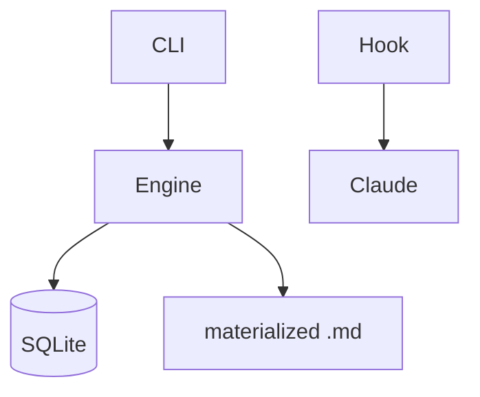

# AICCL Reference

AI Compressed Context Layer — a notation for encoding relational knowledge about codebases in dense, model-friendly format. Not a formal grammar. Works by exploiting model training on mathematical notation, discrete math, Unicode, and emoji.

## Parseable Structures

These are the structured seams that tooling can extract and visualize.

### Node Blocks

```
~~~node
id: auth-jwt
state: active
layer: region
subsystem: authentication
maps: auth
---
∀ req → validate(🎫) → 🏠 | ⊥
🎫.exp < now → 🔑.rotate ∨ invalidate
🏠 ∈ {active, expired, revoked}

💀 passport.js — implicit state, session coupling
✓ custom jwt middleware → stateless, explicit, testable

files: src/middleware/auth.ts:42, src/models/session.ts
~~~
```

**Header fields:**
| Field | Required | Values |
|-------|----------|--------|
| `id` | yes | unique identifier |
| `state` | yes | `active` \| `success` \| `failed` |
| `layer` | no | `continent` \| `region` \| `district` \| `street` \| `ground` |
| `subsystem` | no | domain grouping (e.g., `authentication`, `routing`) |
| `maps` | no | comma-separated map IDs this node uses |
| `claim` | no | assertion this proof step makes |
| `derives-from` | no | comma-separated node IDs this step builds on |
| `proves` | no | comma-separated criterion IDs this step proves |

**Body** is free-form AICCL. Tooling parses state markers and file references but does not validate notation.

### Proof Step Nodes

When a node has `claim`, `derives-from`, and/or `proves` fields, it acts as a proof step — a logical assertion that connects the problem state to the solved state.

```
~~~node
id: jwt-stateless-proof
state: active
layer: district
subsystem: authentication
claim: Stateless JWT validation eliminates session coupling
derives-from: auth-requirements, session-analysis
proves: no-session-coupling, stateless-auth
---
∀ req → validate(🎫) → claims | ⊥
🎫 ∈ {access, refresh} — no 🏠 lookup required
claims.exp < now → reject (no refresh in hot path)

✓ Eliminates session table dependency
✓ Horizontal scaling: any instance validates any token
💀 Session-based auth: coupling, state sync, scale barrier
~~~
```

- **claim**: The human-readable assertion. Rendered prominently on the card.
- **derives-from**: What this step builds on — creates backward edges in the proof graph.
- **proves**: What criteria this step satisfies — creates forward edges to solved state.

Nodes without these fields work exactly as before — they are regular AICCL knowledge nodes.

### Map Blocks

Symbol compression tables. Define once, use everywhere.

```xml
<comp:map:auth>
🔐=auth  🎫=jwt  👤=user  🏠=session  🔑=refresh
M=middleware  V=validate  R=route
</comp:map:auth>
```

**Syntax:** `<comp:map:NAME [uses="PARENT"]>` ... `</comp:map:NAME>`

- Each line: `symbol=expansion` pairs, space-separated
- `uses="parent"` inherits all symbols from parent map
- Maps are scoped to the packet — different packets can redefine symbols
- Map inheritance is hierarchical: layer 3 can use layer 2 which uses layer 1

### Container Blocks

Semantic scope markers for grouping related notation.

```xml
<comp:auth>
∀ req → validate(token) → session | ⊥
token.expiry < now → refresh ∨ invalidate
</comp:auth>
```

**Syntax:** `<comp:NAME[:LAYER]>` ... `</comp:NAME>`

- Not parsed for internal structure — semantic hint for the model
- Optional `:LAYER` suffix for zoom-level scoping (e.g., `<comp:auth:L2>`)

### State Markers

Within node bodies, these markers indicate traversal status:

| Marker | Meaning | Visual |
|--------|---------|--------|
| `[ok]` or `✓` | Proven approach | Green highlight |
| `[dead]` or `💀` | Failed approach — do not retrace | Dimmed/struck |
| `[fail]` or `⊥` | Error/failure state | Red |
| `!` | Invariant — never violate | Bold/warning |

### File References

Nodes should include surgical file pointers so future context windows know where to look:

```
files: src/middleware/auth.ts:42, src/models/session.ts
```

Single line, `files:` prefix, comma-separated `path[:line]` entries.

### Mermaid in AICCL

Nodes can include mermaid diagrams as visual compression — showing data structures, flows, or relationships that are more efficiently expressed visually than symbolically.

````
~~~node
id: packet-architecture
state: active
layer: continent
---


CLI→Engine→{DB,MD}
Hook→Claude→CLI (loop)
````

The mermaid renders visually in the workspace. The AICCL below it is the compressed version for the model.

## Symbol Vocabulary

Not exhaustive — use whatever symbol most precisely communicates the mechanic.

### Logic & Quantifiers
```
∀  for all          ∃  there exists     ∈  element of
→  implies/flows    ↔  bidirectional    ¬  not
∧  and              ∨  or               ⊕  xor
≡  equivalent       ≠  not equal        ≈  approximately
```

### Sets & Structure
```
∩  intersection     ∪  union            ∅  empty
⊂  subset           Σ  aggregate        Π  product/compose
δ  delta/change     ∂  partial
```

### Flow & State
```
⊤  success/true     ⊥  failure/bottom   ⟹  must produce
⟶  sequence/then    ⟳  cycle/loop       ∞  unbounded
↑  promote          ↓  collapse         |  alternative
```

### Emoji Semantic Layer

Emoji are single-token domain concepts. Define them in map blocks.

```
Domain-agnostic: 💀=dead path  ✓=proven  !=invariant  🔒=immutable  ⚡=event
Game:    🧩=piece  📋=grid  🔥=attack  🏆=level
Auth:    🔐=auth   🎫=token  🔑=key    👤=user
Network: 📡=api    🔌=websocket  📦=packet
Storage: 💾=database  📂=filesystem  🗄️=cache
```

## Zoom Layers

Same codebase at different magnifications. Each layer is complete and valid at its level.

| Layer | Scope | What it encodes |
|-------|-------|----------------|
| `continent` | System architecture | Services, data flow, boundaries |
| `region` | Major subsystems | Component interactions, state machines |
| `district` | Component internals | Method logic, contracts |
| `street` | Function precision | Signatures, flow, edge cases |
| `ground` | Implementation | Actual code references |

## Encoding Rules

1. **Express mechanics, not descriptions** — "∀ req → validate(token) → session | ⊥" not "validates tokens for all requests"
2. **Strip domain decoration** — Find the structural skeleton, encode that
3. **Compress with maps** — Define symbols once, use everywhere
4. **Include dead paths** — Future sessions skip what already failed
5. **Mark proven paths** — Future sessions trust what already works
6. **Reference files surgically** — `files: path:line` so you know where to look without re-reading everything
7. **Layer appropriately** — Architectural decisions at continent, implementation details at street
